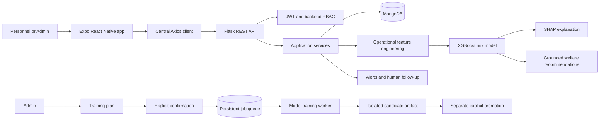

# SURAKSHAI

SURAKSHAI is a personnel welfare decision-support application made up of an
Expo/React Native mobile client and a Python Flask API. The API combines
operational records and voluntary wellness assessments to provide prototype
risk trends, explanations, grounded support recommendations, and human-managed
welfare workflows.

This is a research and decision-support system. It is not a medical device, a
clinical diagnosis tool, a personnel fitness assessment, or an automated
disciplinary or duty-assignment system. Risk outputs require appropriate human
context and review.

## Contents

- [Project layout](#project-layout)
- [What the application does](#what-the-application-does)
- [Architecture](#architecture)
- [Roles and access](#roles-and-access)
- [Local development](#local-development)
- [Configuration](#configuration)
- [API reference](#api-reference)
- [Model training and promotion](#model-training-and-promotion)
- [Security, privacy, and data lifecycle](#security-privacy-and-data-lifecycle)
- [Testing and build checks](#testing-and-build-checks)
- [Troubleshooting](#troubleshooting)
- [Further documentation](#further-documentation)

## Project layout

```text
.
├── README.md
├── stress-management-engine-backend/
│   ├── api_server.py                 Flask API entry point
│   ├── config.py                     Environment and security configuration
│   ├── src/
│   │   ├── db/                       MongoDB client and repositories
│   │   ├── features/                 Operational feature calculation
│   │   ├── integrations/             HRMS payload adapter
│   │   ├── ml/                       Risk, SHAP, recommendation, training services
│   │   ├── reports/                  Welfare report assembly and PDF generation
│   │   ├── schemas/                  Request validation and normalization
│   │   ├── security/                 JWT, RBAC, consent, audit, rate limits
│   │   ├── services/                 Application services
│   │   └── welfare/                  Alerts, interventions, support requests
│   ├── scripts/                      Training, worker, and synthetic-data commands
│   ├── tests/                        Python unittest suite
│   ├── models/risk/                  Baseline and candidate model artifacts
│   ├── data/                         Canonical synthetic training dataset
│   ├── requirements.txt
│   └── .env.example
└── stress-management-engine-mobile/
    ├── App.tsx                       React Native application root
    ├── app.json                      Expo app configuration
    ├── src/
    │   ├── api/                      Central Axios client, endpoint paths, DTOs
    │   ├── auth/                     Session context and secure storage
    │   ├── components/               Shared interface components
    │   ├── hooks/                    Network state and app hooks
    │   ├── navigation/                Role-specific React Navigation stacks
    │   ├── screens/                  Login, personnel, and admin screens
    │   ├── services/                 API operations and response validation
    │   ├── types/                    App and API-facing types
    │   └── utils/                    Shared client utilities
    ├── package.json
    └── .env.example
```

The mobile project is a React Native application. Expo can also bundle that
same application for web preview/export; there is no separate React web
frontend in this repository.

## What the application does

### Personnel experience

- Sign in with an account provisioned by an administrator or development seed.
- Review profile and session details, then securely log out.
- View personal risk status, risk history, and a SHAP-based explanation.
- Read welfare recommendations and their supporting sources when available.
- Review support alerts and their current workflow status.
- Manage consent settings.
- Submit and view voluntary wellness assessments. Wellness processing requires
  current `WELLNESS_DATA_PROCESSING` consent. The backend allows one assessment
  per personnel member per date.
- Request human follow-up and review the request's status.

### Admin experience

- Create a constrained model-training plan through the training chat.
- Review and explicitly confirm the plan before a job is queued.
- View training jobs and model versions.
- Promote a successfully validated candidate as a separate action.

The mobile administrator experience is focused on model training and versions.
Additional administrative API functions such as user management and HRMS
payload synchronization are exposed by the backend but do not have dedicated
mobile screens here.

### Welfare workflows

The backend supports staff-facing alert review, acknowledgment, intervention
planning, scheduling, resolution, and dismissal. Personnel can request human
follow-up, but cannot set staff workflow status. Alerts are generated from
persistence-based risk signals and are intended for authorized human review;
the system does not automatically initiate an intervention.

## Architecture



The mobile app keeps API paths in `src/api/endpoints.ts` and uses the single
Axios instance in `src/api/client.ts`. The base URL is supplied at build time
through `EXPO_PUBLIC_API_BASE_URL`; individual screen and service modules do
not contain deployment URLs. Authenticated requests receive a Bearer token from
the active secure session.

The backend is organized around Flask routes, schema validation, service
objects, repository interfaces, and security helpers. Its current risk path is
operational records → feature engineering → XGBoost prediction → SHAP
explanation → optional grounded recommendation and human welfare workflows.
The retained WorkWell/WESAD physiological pipeline is legacy compatibility
code and is not the current SURAKSHAI risk path.

## Roles and access

The backend enforces authorization on each protected route. Hiding a screen in
the app is not the access-control boundary.

| Backend role | Typical access |
| --- | --- |
| `PERSONNEL` | Own profile, consent, operational views, risk information, own wellness, and own support requests. Wellness actions also require consent. |
| `WELFARE_OFFICER` | Authorized welfare personnel, alerts, permitted operational/wellness views, and support follow-up workflows. |
| `COMMANDER` | Limited aggregate/dashboard and model-analytics permissions according to backend policy; no access to individual wellness records or staff welfare workflows. |
| `ADMIN` | Personnel and user administration, operational management, welfare workflows, HRMS sync, and model lifecycle operations. |

The current mobile login/navigation supports `PERSONNEL` and `ADMIN` accounts.
`WELFARE_OFFICER` and `COMMANDER` permissions exist in the backend API, but
those roles are not accepted by the current mobile navigation.

## Local development

### Requirements

- Python and pip for the backend.
- Node.js and npm for the mobile app.
- MongoDB for persistent users, consent, wellness, operational, workflow, and
  training-job records. A local MongoDB or a separately configured development
  database can be used.
- An iOS simulator, Android emulator, or device with Expo Go for device testing.

### Start the backend

In PowerShell:

```powershell
cd stress-management-engine-backend
py -m venv .venv
.\.venv\Scripts\Activate.ps1
python -m pip install --upgrade pip
pip install -r requirements.txt
Copy-Item .env.example .env
```

Edit `.env` for your local environment. Set `APP_ENV=development`, configure a
development MongoDB URI/database, and replace the example JWT and
pseudonymization values with local-only values. Do not use the sample values in
production. For the local database example, `.env.example` uses
`mongodb://localhost:27017` and `personnel_welfare`.

Start Flask:

```powershell
python api_server.py
```

The default local port is `5000`; `PORT` can override it. Check the service:

```powershell
Invoke-RestMethod http://localhost:5000/health
```

`GET /health` confirms the API process responds; it does not ping MongoDB.
Persistent API features also need a reachable, correctly configured database.

### Start the mobile app

In a second terminal:

```powershell
cd stress-management-engine-mobile
npm ci
Copy-Item .env.example .env
npm start
```

The checked-in mobile `.env.example` points to the current Render backend:

```dotenv
EXPO_PUBLIC_API_BASE_URL=https://surakshai-backend.onrender.com
```

For local testing, change the value in your untracked `.env` to the backend
address reachable by the device. A physical phone generally needs the
development computer's LAN address; `localhost` on the phone refers to the
phone itself. The API client appends route paths such as `/health` and
`/auth/login`; do not add an `/api` prefix or an extra trailing slash.

Useful app commands:

```powershell
npm start
npm run android
npm run ios
npm run web
```

The web command runs the same React Native/Expo application through React
Native Web. It is useful for previewing, but it is not a separate web product.

Development demo users are bootstrapped only when both `APP_ENV=development`
and `SURAKSHAI_ENABLE_DEV_USER_SEED=1` are set. Account passwords should be
handled locally and must not be put in this README, source code, or a committed
environment file. No public self-registration flow is provided.

## Configuration

The backend's complete variable list and safe placeholders are in
[`stress-management-engine-backend/.env.example`](stress-management-engine-backend/.env.example).
The mobile base URL example is in
[`stress-management-engine-mobile/.env.example`](stress-management-engine-mobile/.env.example).
Both projects ignore local `.env` files; only example files belong in source
control. Any `EXPO_PUBLIC_*` value is bundled into the mobile app and must be
treated as public configuration, never as a secret.

### Backend environment variables

| Variable | Purpose and notes |
| --- | --- |
| `APP_ENV` | `development`, `test`, or `production`. Set explicitly in deployment. |
| `PORT` | HTTP port; defaults to `5000` for the direct Flask development entry point. |
| `JWT_SECRET_KEY` | Required to issue/validate access tokens. Production must use a random value at least 32 characters long. |
| `JWT_ALGORITHM` | HMAC algorithm: `HS256`, `HS384`, or `HS512`; default `HS256`. |
| `JWT_ACCESS_TOKEN_EXPIRES_MINUTES` | Token lifetime from 1 to 60 minutes; default 60. |
| `JWT_ISSUER`, `JWT_AUDIENCE` | JWT validation claims; defaults are `surakshai-api` and `surakshai-client`. |
| `PSEUDONYMIZATION_SECRET` | Required for stable derived pseudonyms. In production it must be distinct from the JWT key and at least 32 random characters. |
| `MONGODB_URI` | MongoDB connection string. Keep it in the host's secret/environment settings. |
| `MONGODB_DATABASE` | Database name; defaults to `personnel_welfare` and is limited to 38 UTF-8 bytes. |
| `MONGODB_TIMEOUT_MS` | Server selection timeout from 100–30,000 ms; default 3,000. |
| `MONGODB_TLS` | For production non-SRV MongoDB connections, set `true`. SRV connections use driver TLS defaults. |
| `CORS_ALLOWED_ORIGINS` | Comma-separated explicit origins. Production requires HTTPS origins. Native mobile networking is not governed by browser CORS, but the Expo web target is. |
| `DEBUG` | Development only; production debug is disabled. |
| `MAX_REQUEST_SIZE_BYTES` | Request body limit; default 1 MiB, allowed range 1 KiB–10 MiB. |
| `LOGIN_RATE_LIMIT`, `ADMIN_USER_RATE_LIMIT`, `HRMS_SYNC_RATE_LIMIT` | Per-process request limits; default 10, 20, and 10 requests respectively. |
| `RATE_LIMIT_WINDOW_SECONDS` | Rate-limit window; default 60 seconds. Limits are process-local, so a multi-instance deployment needs a shared gateway limit. |
| `SURAKSHAI_ENABLE_DEV_USER_SEED` | Set to `1` only for local development user bootstrap; never enable this for production. |
| `SURAKSHAI_ENABLE_SYNTHETIC_SEED` | Enables guarded synthetic development/staging dataset creation only. Requires a development environment and explicitly named dev/staging database. |
| `SURAKSHAI_SYNTHETIC_PERSONNEL_COUNT` | Synthetic personnel count; default 30, allowed range 20–50. |
| `SURAKSHAI_SYNTHETIC_SEED_BATCH_ID`, `SYNTHETIC_DATA_RANDOM_SEED`, `SYNTHETIC_DATA_AS_OF` | Reproducible synthetic dataset batch, random seed, and date anchor. |
| `SURAKSHAI_STAGING_*_PASSWORD` | Local-only passwords for synthetic staging accounts, when the seed workflow requires them. Set outside source control. |
| `SURAKSHAI_RESET_SYNTHETIC_DATA` | Must be explicitly set to `1` before resetting records tagged with the selected seed batch. |
| `SURAKSHAI_LLM_BASE_URL`, `SURAKSHAI_LLM_MODEL`, `SURAKSHAI_LLM_API_KEY` | Optional OpenAI-compatible recommendation provider. The API key is a secret. Recommendation generation fails closed when no provider is configured. |
| `SURAKSHAI_EMBEDDING_MODEL` | Embedding model setting; example default is `sentence-transformers/all-MiniLM-L6-v2`. |
| `WELFARE_ALERT_PERSISTENCE_WINDOW_DAYS`, `WELFARE_ALERT_ELEVATED_OBSERVATIONS`, `WELFARE_ALERT_HIGH_OBSERVATIONS`, `WELFARE_ALERT_COOLDOWN_DAYS` | Persistence and cooldown policy inputs for welfare alert evaluation. Defaults are 7, 2, 2, and 7. |
| `WELLNESS_RETENTION_DAYS`, `RISK_RETENTION_DAYS`, `AUDIT_RETENTION_DAYS` | Governance placeholders only. Unset values mean no approved period; these variables do not currently run automatic deletion. |

The direct `python api_server.py` entry point validates production JWT and
pseudonymization secrets, explicit HTTPS CORS origins, MongoDB configuration,
and token settings. A process manager that imports the Flask `app` object does
not run that `__main__` block; deployments using an import-based WSGI command
must validate their environment as part of deployment configuration. Use
separate values for development, staging, and production. Do not paste secrets
into issue reports, logs, README files, or mobile configuration.

The mobile `.env.example` currently targets the deployed Render API. Build the
mobile app with the intended `EXPO_PUBLIC_API_BASE_URL`, since Expo public
environment values are included in the client bundle. For API hosting, supply
the backend's production environment variables and bind the Flask WSGI server
to the port provided by the hosting platform. If enabling model training, run
the worker with the same MongoDB and durable model-artifact storage available
to the API process; the repository does not include platform-specific
deployment manifests.

### Mobile environment variable

| Variable | Purpose |
| --- | --- |
| `EXPO_PUBLIC_API_BASE_URL` | Base address for the Flask API. The current example uses `https://surakshai-backend.onrender.com`. It is public app configuration and contains no credential. |

## API reference

Protected routes require:

```http
Authorization: Bearer <access-token>
```

Tokens are returned by `POST /auth/login`. The list below groups the current
Flask routes by feature. `<personnel_id>`, `<domain>`, and other bracketed
values are path parameters. Authorization is evaluated by the backend.

### Public and authentication

| Method | Path | Purpose |
| --- | --- | --- |
| `GET` | `/` | API metadata and current model summary. |
| `GET` | `/health` | Process health response. |
| `POST` | `/auth/login` | Authenticate a username/password and issue a short-lived Bearer token. |

### Consent and personnel data

| Method | Path | Purpose |
| --- | --- | --- |
| `GET`, `POST` | `/consent` | Read consent state or append a grant/revoke transition. |
| `GET` | `/personnel/<personnel_id>/operational/<domain>` | Read authorized personnel operational records. |
| `GET` | `/personnel/<personnel_id>/features` | Compute/view permitted operational feature data. |
| `GET`, `POST` | `/personnel/me/wellness` | List or submit the authenticated personnel member's wellness data. |
| `GET`, `DELETE` | `/personnel/me/wellness/<assessment_id>` | Read or delete an owned wellness assessment. |
| `GET` | `/personnel/<personnel_id>/wellness` | Staff-authorized wellness record view. |
| `POST`, `GET` | `/personnel/me/support-requests` | Create or list the authenticated member's human follow-up requests. |
| `GET` | `/personnel/me/support-requests/<support_request_id>` | Read one owned support request. |

Wellness JSON requires `assessment_date` (`YYYY-MM-DD`) and integer values from
1 through 5 for `sleep_quality`, `fatigue_level`, `perceived_stress`, and
`mood_wellbeing`. The date cannot be in the future. Wellness GET/POST is
PERSONNEL-only and gated by `WELLNESS_DATA_PROCESSING` consent. Duplicate
person/date submissions return `409 Conflict`.

The backend supports four consent types: `WELLNESS_DATA_PROCESSING`,
`BIOMETRIC_DATA_PROCESSING`, `RECOMMENDATION_PROCESSING`, and `DATA_SHARING`.
Risk predictions may include the latest voluntary wellness assessment only
when the authenticated user has granted wellness-processing consent; otherwise
the risk service runs in `OPERATIONAL_ONLY` mode. Consent transitions are
recorded, and current consent state is resolved from the latest transition.

Support requests accept a category (`GENERAL_WELFARE`, `WORKLOAD_FATIGUE`,
`SLEEP_RECOVERY`, `PERSONAL_SUPPORT`, or `OTHER`), urgency (`NORMAL` or
`URGENT`), and optional message of up to 2,000 characters. They may optionally
reference an alert. Personnel can view their requests; authorized staff manage
follow-up status.

### Operational records

`<domain>` is one of `duty_records`, `leave_records`, `deployment_records`,
`transfer_records`, `training_records`, or `workload_records`.

| Method | Path | Purpose |
| --- | --- | --- |
| `GET`, `POST` | `/operational/<domain>` | List or create authorized operational records. |
| `GET`, `PUT`, `PATCH`, `DELETE` | `/operational/<domain>/<record_id>` | Read, replace/update, or delete an authorized record. |
| `GET` | `/operational/summary` | Aggregate operational summary for permitted roles. |

The schema for each record domain is validated by the backend; it does not
accept arbitrary field names. HRMS ingestion is a separate administrative
payload boundary described below.

### Risk, recommendations, reports, and dashboards

| Method | Path | Purpose |
| --- | --- | --- |
| `GET` | `/personnel/<personnel_id>/risk-prediction` | Current risk category and probabilities. |
| `GET` | `/personnel/<personnel_id>/risk-history` | Stored historical risk observations. |
| `GET` | `/personnel/<personnel_id>/risk-explanation` | Prediction explanation with SHAP contributors. |
| `GET` | `/personnel/<personnel_id>/welfare-recommendations` | Grounded welfare guidance and available sources. |
| `GET` | `/personnel/<personnel_id>/welfare-report` | Authorized welfare report. |
| `GET` | `/welfare/risk-summary` | Welfare risk aggregate. |
| `GET` | `/welfare/dashboard/summary` | Welfare dashboard aggregate. |
| `GET` | `/welfare/personnel` | Authorized welfare personnel list. |
| `GET` | `/welfare/personnel/<personnel_id>` | Authorized welfare personnel detail. |

The current prototype reports `LOW`, `ELEVATED`, or `HIGH` classes from the
canonical XGBoost model (`surakshai-risk-v0.1`) using a 31-feature schema.
Recommendations use the dedicated `surakshai_welfare_knowledge` Chroma
collection; an optional configured LLM provider may synthesize source-grounded
text. A provider is not required for model prediction or SHAP explanations.

### Alerts and human follow-up

| Method | Path | Purpose |
| --- | --- | --- |
| `GET` | `/personnel/<personnel_id>/alerts` | Read alerts shared with the specified authorized personnel member. |
| `GET` | `/welfare/alerts` | Staff alert queue. |
| `POST` | `/welfare/alerts/evaluate/<personnel_id>` | Evaluate persistence rules for a personnel member. |
| `GET` | `/welfare/alerts/<alert_id>` | Read an authorized alert. |
| `POST` | `/welfare/alerts/<alert_id>/acknowledge` | Acknowledge an alert. |
| `POST` | `/welfare/alerts/<alert_id>/review` | Record staff review. |
| `POST` | `/welfare/alerts/<alert_id>/follow-up` | Schedule a follow-up. |
| `POST` | `/welfare/alerts/<alert_id>/resolve` | Resolve an alert with an outcome. |
| `POST` | `/welfare/alerts/<alert_id>/dismiss` | Dismiss an alert under workflow rules. |
| `POST` | `/welfare/alerts/<alert_id>/intervention` | Create a welfare intervention. |
| `PATCH` | `/welfare/interventions/<intervention_id>` | Update an authorized intervention. |

Personnel support-request staff queue and actions:

| Method | Path | Purpose |
| --- | --- | --- |
| `GET` | `/welfare/support-requests` | List requests available to authorized welfare staff. |
| `POST` | `/welfare/support-requests/<support_request_id>/acknowledge` | Acknowledge a request. |
| `POST` | `/welfare/support-requests/<support_request_id>/schedule` | Schedule a follow-up. |
| `POST` | `/welfare/support-requests/<support_request_id>/start` | Start follow-up. |
| `POST` | `/welfare/support-requests/<support_request_id>/resolve` | Resolve the request. |

### Administrative APIs

| Method | Path | Purpose |
| --- | --- | --- |
| `GET`, `POST` | `/admin/users` | List or create application users. |
| `GET`, `PATCH` | `/admin/users/<user_id>` | Read or update an application user. |
| `POST` | `/admin/integrations/hrms/sync` | Import up to 500 normalized HRMS personnel records. |
| `POST` | `/admin/model-training/plan` | Validate and save a candidate training plan. |
| `POST` | `/admin/model-training/confirm` or `/admin/model-training/jobs` | Explicitly confirm/enqueue a plan. |
| `GET` | `/admin/model-training/jobs` | List jobs; supports `status` and `limit` query parameters. |
| `GET` | `/admin/model-training/jobs/<job_id>` | Read one job. |
| `GET` | `/admin/models` or `/admin/model-training/models` | Read active and candidate model versions. |
| `POST` | `/admin/models/<model_id>/promote` or `/admin/model-training/models/<model_id>/promote` | Promote an eligible candidate. |

HRMS synchronization accepts normalized records; it does not connect to an
external HRMS and does not create user accounts. The `personnel_id` field may
map an existing internal record and is not derived from an external identifier.
The backend returns conflicts for ambiguous mappings and validates record
fields and batch size.

## Model training and promotion

Training is restricted to an ADMIN-authorized route and uses the canonical
Phase 4 CSV and existing XGBoost pipeline. The API does not accept arbitrary
code, shell commands, SQL, paths, dataset selections, or model families.

The lifecycle is:

1. Admin submits a supported instruction or allow-listed config.
2. Backend validates it and saves a plan in `AWAITING_CONFIRMATION`.
3. Admin explicitly confirms the plan; confirmation queues the job but does
   not train inside the API request.
4. A separate worker changes the job through `QUEUED` and `RUNNING`, then
   records `SUCCEEDED` or `FAILED`.
5. Successful candidate artifacts and metadata are written under
   `models/risk/candidates/<job_id>/`, and include model version, feature
   version, dataset ID, and evaluation metrics.
6. The candidate remains separate from the active model. Promotion is a
   distinct explicit ADMIN action that updates the active model pointer and
   preserves a rollback pointer.

The accepted instruction is deliberately narrow. Supported human-language
requests include “Train a new candidate risk model using the latest approved
dataset.” Configurable fields are `n_estimators` (50–1000), `learning_rate`
(0.001–0.3), `max_depth` (2–12), `subsample` (0.5–1.0), and
`colsample_bytree` (0.5–1.0). Other or ambiguous instructions fail closed.

Start the worker from the backend directory:

```powershell
python scripts/run_model_training_worker.py
```

It polls MongoDB every two seconds by default. `--poll-interval-seconds 5`
changes the interval and `--once` processes at most one queued job. In a
multi-process deployment, the API and worker need the same environment,
MongoDB job queue, and durable/shared access to model artifacts and active model
pointer files. A worker must be running for queued jobs to progress.

## Security, privacy, and data lifecycle

- Authentication uses short-lived JWT Bearer tokens. The mobile app stores the
  session using Expo SecureStore and clears an expired session after a 401.
- Backend route decorators and services enforce role permissions and
  resource ownership. The client UI is not treated as authorization.
- Wellness assessments are voluntary and require explicit processing consent.
  Consent grants and revocations are recorded as transitions; revoking consent
  does not silently erase earlier records.
- Passwords are hashed by the backend user service. Never place user passwords,
  JWTs, database connection strings, or provider keys in source control.
- HRMS sync is limited to normalized payloads; this code does not call a live
  HRMS service.
- Candidate training is constrained to allow-listed settings and validated
  metadata. Candidate training does not replace the active model; promotion is
  separate.
- The legacy WorkWell/WESAD path is retained for compatibility and is not the
  current personnel risk pipeline.
- The retention variables are placeholders; there is no automatic age-based
  cleanup job. Account disablement retains the account record. Personnel
  deactivation retains related history. Wellness has an explicit owned-record
  deletion route, but other data domains are not automatically cascaded away.
- The current audit service uses an in-memory development store. Production
  deployments need an approved durable, access-controlled audit sink and
  retention policy. Operators are responsible for MongoDB backups, encryption,
  restore testing, and recovery procedures.
- When the optional language-model recommendation provider is enabled,
  recommendation context may be sent to that configured external provider.
  Review provider terms, data handling, and consent requirements before enabling
  it for real personnel data.

Production must set `APP_ENV=production`, distinct random JWT and
pseudonymization secrets, explicit HTTPS CORS origins, a production MongoDB
connection, and appropriate rate limits. The `.env.example` values are for
local setup only. Store production values in the deployment platform's secret
configuration, not in this repository.

## Testing and build checks

### Backend

From `stress-management-engine-backend` with the virtual environment active:

```powershell
python -m unittest discover -s tests
```

### Mobile

From `stress-management-engine-mobile`:

```powershell
npm test -- --runInBand
npm run typecheck
npm run lint
npx expo-doctor@latest
```

Expo exports for the native Android app bundle or the web build of the same
React Native app:

```powershell
npx expo export --platform android
npx expo export --platform web
```

If the local Windows environment cannot execute Expo's Hermes compiler, the
export CLI supports `--no-bytecode` as a diagnostic workaround. The standard
export should be preferred for normal release validation. Build output is
generated under `dist/` and should not be committed.

The API smoke check can be run without credentials:

```powershell
Invoke-RestMethod http://localhost:5000/health
```

Protected route checks require an authorized test account and should use
locally supplied credentials, never credentials embedded in test source or
README examples.

## Troubleshooting

| Symptom | Checks |
| --- | --- |
| Mobile app cannot reach backend | Verify `EXPO_PUBLIC_API_BASE_URL`, backend health, device network, and that the URL has no extra `/api` prefix or double slash. Restart Expo after changing `.env`. |
| Login returns 401 | Confirm the account exists, is active, and the password is correct for the backend database currently configured. Avoid copying credentials into source or logs. |
| Login returns 503 or database health is unavailable | Check the backend's MongoDB configuration, database allowlist/network access, and service logs without printing the URI. |
| Wellness returns 403 | Verify the account is `PERSONNEL`, the JWT maps to the expected personnel identity, and `WELLNESS_DATA_PROCESSING` consent is currently granted for that user. |
| Wellness returns 409 | Check whether an assessment already exists for the selected `personnel_id` and date. The backend intentionally enforces one per day; it does not overwrite the existing entry. |
| Recommendations unavailable | Confirm grounded knowledge sources are configured and, if text synthesis is expected, configure the optional provider values. The system fails closed when provider settings are incomplete. |
| Training remains queued | Ensure a worker process is running with the same MongoDB and model-artifact storage configuration as the API service. |
| Candidate is not active | Candidate creation and promotion are separate lifecycle actions. Only a successfully validated candidate can be promoted. |
| Expo export fails on Windows | Check Metro output for the underlying native tool error. If Hermes bytecode execution is blocked locally, try the documented `--no-bytecode` diagnostic export. |

## Further documentation

- Backend setup, model lifecycle, HRMS boundary, seed safety, and detailed
  operational notes: [`stress-management-engine-backend/README.md`](stress-management-engine-backend/README.md)
- Backend environment template: [`stress-management-engine-backend/.env.example`](stress-management-engine-backend/.env.example)
- Mobile environment template: [`stress-management-engine-mobile/.env.example`](stress-management-engine-mobile/.env.example)
- Mobile dependencies and commands: [`stress-management-engine-mobile/package.json`](stress-management-engine-mobile/package.json)

